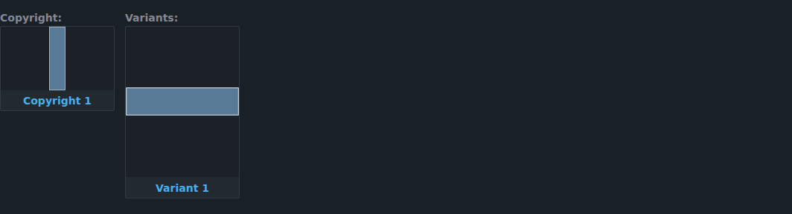
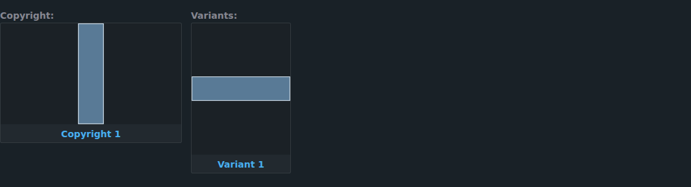
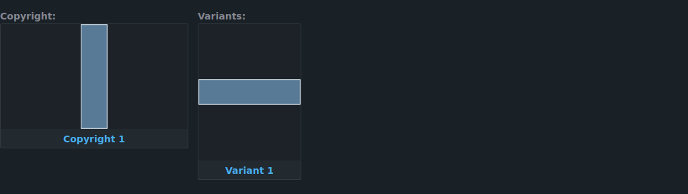
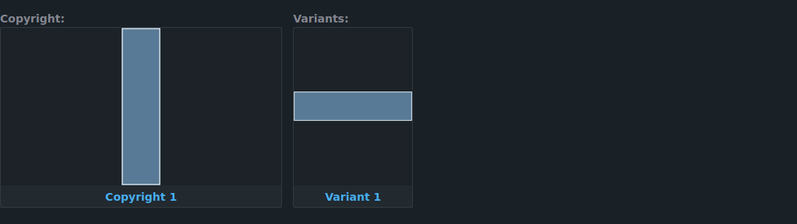

# P07 native global media

The top-level All navigation entry opens `/media`. Images and Videos keep their
existing `/images` and `/scenes` pages beside it in the navbar. All has no second
media-type tab row. Legacy `/media/images` and `/media/videos` links redirect to
the native pages and retain their query parameters and history state.

All is included in the backend's default navigation. A customized menu can enable it in
Settings → Interface → Menu items.

## Query and identity

`findMedia(media_filter, filter)` returns a total, Image/Video counts and an
ordered page of `MediaItem` records. Each item has one native Image or Scene and
a typed key such as `image:123` or `scene:123`. Selection retains that key until
an action dispatches the native numeric ID to the appropriate API.

Both native filters select matching IDs in the same read transaction. One SQL
`UNION ALL` applies a shared sort and page boundary. Hydration reads only the
selected native records. The count query projects only identities; path/file
lookups run only when required by the requested sort.

Supported sorts are date, title, rating, path, file size, created and updated
timestamps. The page defaults to date descending; an API request without a sort
uses created ascending, consistent with native `FindFilterType` defaults. All
sorts end with kind ascending (`IMAGE` before `VIDEO`) then numeric ID ascending.
Missing values sort last in both directions; empty titles/dates are missing.
Titles and paths use native natural, case-insensitive collation. File size/path
refer to the native primary file; records without one have missing values.

Page sizes range from 1 to 500 (API default 25). Unbounded pages and unsupported
sort names are rejected. Counts describe all matches, including past-end pages.
Each catalogue entry remains one row, including animated Images. These typed
identities remain suitable for future P08 stack members.

## Filters and view state

Text search, title, details, path, rating, dates/timestamps, organized status,
favorite Characters, Tags, Characters, Artists and Copyrights use their existing
native predicates. Hierarchy depth and P06 inheritance retain native semantics.
Any duration criterion, including
`IS_NULL`, excludes Images; the page shows that rule while the criterion is active.

Shared criteria, sort, page size, Grid/Wall mode and zoom are preserved in the
URL/native filter state. Saved All filters store shared criteria. Selection carries
across pages. Eight in-memory history snapshots retain selection and scroll for
back navigation during the browser session; reloading clears those snapshots.

The page renders at most 500 native cards/wall items at once. Image previews and
Video queues follow native behavior using the current page's respective kinds.
Animation badges are native shared components; they do not classify a preview
video as a separate Scene.

## Selection actions

| Action | Supported selection |
| --- | --- |
| Edit metadata | Images and Videos: title, details, date, rating, organized status, primary Artist, Character links and Tags. |
| Convert | Images and Videos, dispatched as native `image`/`scene` targets. |
| Upscale | Images; selected Videos are excluded, counted in the action explanation and shown inside the dialog. Disabled if no Images are selected. |

Mixed edits use two native transactions with the existing hooks and validation.
Each type's result is reported separately. If one succeeds and the other fails,
the editor locks the submitted fields and retries only the failed type. Closing
after partial success refreshes the list and clears the completed selection.

## Verification

Fresh SQLite integration tests check alternating dates across page boundaries,
both directions, ties/nulls, natural text/path sorting, file-size sorting,
type counts, shared filters, inherited profile Tags/hierarchies, favorites,
duration semantics, typed GraphQL payloads, native bulk writers and query bounds.
UI tests check equal-ID selection, deduplication, conversion target identity,
native mutation dispatch, empty selections and partial failures.

The full backend/UI checks and production builds passed. A running isolated
application also passed the actual UI query/fragments, filtered counts, native
metadata writes and new/existing list-route HTTP smoke checks.

P07 was merged in [PR #119](https://github.com/Dusky-dev/StashBooru/pull/119);
its Build and Go lint workflows passed. Navigation corrections were merged in
[PR #120](https://github.com/Dusky-dev/StashBooru/pull/120).
The native All list rework was merged in
[PR #121](https://github.com/Dusky-dev/StashBooru/pull/121).
Character edit cleanup and restored Video previews were merged in
[PR #122](https://github.com/Dusky-dev/StashBooru/pull/122).

The All list now follows the native Images/Videos structure: saved filter sidebar,
toolbar and operations menu, cached pagination, loaded list body and native
cards. Lightbox synchronization mounts inside the loaded body. Previously it
mounted while a query was loading, and fresh empty arrays caused React's update
depth limit to fail. Wall uses the native Video styling and preview source
selection, safe dimensions, bounded row height and native Video queue links.

The optional mounted-browser regression suite covers delayed, empty, Video-only
and failed queries, mixed Grid selection, Wall navigation/back and absence of
duplicate type tabs. Run it against an isolated instance containing Images and
Videos with Playwright available:

```sh
STASH_BROWSER_URL=http://127.0.0.1:9999 node ui/v2.5/tests/browser/all-media.mjs
```

`PLAYWRIGHT_MODULE` can specify an absolute Playwright module path and
`CHROMIUM_EXECUTABLE` a browser executable. This suite injects delayed/error
responses only inside its own browser; it does not modify library records.
Unit regressions also cover missing/failed preview sources and invalid dimensions.

## Character editing, relation cards and Video previews

The existing Character/Artist/Tag All enhancement now deactivates its inline
pane when editing removes the native tab navigation. Its media contents unmount;
cancelling restores the native tabs with All inactive.

Copyrights and Variants sit together at their content width with a one-rem gap.
Copyright card images now use landscape (16:9) frames; Character/Variant frames
are portrait, and Artist frames are square. Copyright and relation images use
`object-fit: contain` so sources with different proportions are not stretched
or cropped. Native Character cards retain their existing portrait layout.
Copyright and Variant image frames share one height. The height retains the
existing Variant bounds (11 rem or 30% of viewport height, converted from its
portrait width), and shrinks when necessary to fit a landscape Copyright within
the available row. Width derives from the shared height at 16:9 or 3:4, allowing
for card borders and a vertical scrollbar. Frames stay within 40% of viewport
height even on short windows.
The desktop row reserves up to 65% for Copyrights and 35% for Variants; mobile
sections can use the full row width and wrap. Names wrap.
Each relation list grows with its contents up to the smaller of 24 rem and half the viewport
height, then scrolls internally; no records are hidden by line clamping.

Video cards again show the magnifying-glass preview button outside selection
mode. Scoped All uses its existing mixed preview carousel; global All and Videos
use the shared native ScenePlayer preview host and current mounted Video cards.
An Image preview in global All explicitly restores its Image list after a Video
preview closes. The player's queued marker setup exits if navigation already
disposed the player.

The Chromium suite checks Video previews and carousel navigation on global All
and native Videos, then opens an Image after closing a Video. The Character
suite also checks scoped All previews, editing while All is selected, portrait
and landscape card dimensions, 18-item relation lists and mobile overflow:

```sh
STASH_BROWSER_URL=http://127.0.0.1:9999 STASH_BROWSER_CHARACTER_ID=123 \
  node ui/v2.5/tests/browser/character-media.mjs
```

Use an isolated Character linked to an Image, Video, Copyright and direct
Variant. This suite substitutes relation images/counts only in its own browser
and makes no metadata writes. `STASH_BROWSER_SCREENSHOT_PREFIX` optionally saves
desktop and mobile captures. All 28 UI tests, TypeScript, lint, formatting, the
built-in checksum/syntax checks and production build passed with these changes.
Real-file playback and external processing services remain outside these
synthetic-fixture browser checks.

## Navbar order and stable Video previews

The navbar's DOM and keyboard order is All, Images, Videos, Characters, Artists,
Copyrights, Tags, Galleries, Collections. All has its own capitalized message
instead of using the lowercase inline `all` translation. Existing enabled-menu
preferences still determine which entries appear.

A mounted-browser regression reproduced an unrelated lightbox caller's live
Image refresh replacing an open Video preview. Each `useLightbox` caller now
claims the viewer when opening; only that caller can synchronize its active
contents. Opens read the caller's latest data and reset inherited callbacks and
slideshow state. The opener's identity remains stable across renders.

The global Video bridge keeps opener functions in refs, rejects duplicate open
requests and invalidates queued work when closing. Video previews disable
slideshow/autostart; next/previous remain explicit native controls. The ScenePlayer
still plays the selected Video automatically.

Additional read-only Chromium suites:

```sh
STASH_BROWSER_URL=http://127.0.0.1:9999 node ui/v2.5/tests/browser/preview-stability.mjs
STASH_BROWSER_URL=http://127.0.0.1:9999 node ui/v2.5/tests/browser/navigation-card-shapes.mjs
```

Use an isolated instance with multiple Videos plus Character, Artist and Copyright
records. The stability fixture refreshes a second lightbox caller and Apollo's
local resume cache, samples the active preview beyond the default slideshow
interval, then checks double-click/repeated opens and dismissals through Escape,
browser Back and the close button. The shape suite verifies desktop/mobile menu
order and native card ratios using opposite-shape source images. The Character
suite also checks relation ratios on a short viewport. These suites make no
metadata writes; synthetic fixtures do not verify real-file decoding or playback.

## Preview identity during metadata refreshes

Refreshing native Video card metadata previously removed/re-added its registry
entry and moved it to the end of the preview list. The native player used the
updated list's numeric index while the DOM observer still used the list from
opening. A regression reproduced four different Videos mounting behind one
unchanged footer link, so checking the footer alone did not detect the cycling.

Card metadata now updates an existing registration. Each open preview captures
its media identities and order; the native Lightbox and player share that
sequence until dismissal. Current metadata still updates by typed
identity, without replacing the media at an index. Closing releases the queue,
and reopening captures the current list, including its visible sort order. This
applies to global All, Videos and
the existing Character/Artist/Tag mixed All preview path. Explicit next/previous
controls remain available; Video completion does not advance the preview.

The read-only queue regression instruments the actual native ScenePlayer ID,
refreshes every Video's local Apollo metadata, reorders the Character All list,
waits beyond the slideshow interval, navigates explicitly, and closes/reopens:

```sh
STASH_BROWSER_URL=http://127.0.0.1:9999 STASH_BROWSER_CHARACTER_ID=123 \
  node ui/v2.5/tests/browser/preview-queue-stability.mjs
```

Use an isolated fixture containing multiple Videos and a Character associated
with at least two of them. Optional `STASH_BROWSER_VIDEO_FILE=/path/to/clip.webm`
supplies a four-second VP8 clip. The suite substitutes browser-local VideoFile
metadata/stream responses and intercepts playback-activity writes, verifies
decoding/playback to completion in the native player, and checks the selected
identity throughout. Create a matching fixture with:

```sh
ffmpeg -f lavfi -i testsrc2=size=320x180:rate=12 -t 4 -c:v libvpx \
  -b:v 160k -an preview-test.webm
```

This clip check establishes VP8 playback in headless Chromium; other production
files/codecs, browser engines and physical devices require separate checks.

The relation width comparison uses the same opposite-shape source images in
both captures. The before capture temporarily applies the previous sizing CSS
in the browser fixture; the after capture uses the current production CSS.

| Previous sizing | Wider landscape sizing |
| --- | --- |
|  |  |

## Declarative Video preview opening — 2026-10-02

Video previews now use the native Lightbox's selected-media renderer. The old
carousel-position MutationObserver, SVG placeholder, fixed-position portal and
footer DOM rewrite are removed. Only the selected Video mounts a ScenePlayer;
neighbouring slides contain no player. Custom-media navigation is immediate,
so an outgoing player is not animated through the next Video's opening frame.

The selected typed ID controls the data query, native player and footer link.
The native fit/zoom/pan wrapper measures before painting; fitted player controls
retain their normal size. Video completion does not advance the queue. The
Video footer navigates directly to its detail route and disposes the preview.
Thumbnail requests abort on source changes/disposal, and late responses cannot
attach UI to another or disposed player. Cancelled autoplay promises are handled.

The opening regression starts recording before the magnifying-glass click. It
checks cold/warm first, middle and last Videos on global All, mobile Videos and
Character All, actual native-player render/mount IDs, every sampled frame's
footer and geometry, fitted control size, zoom/reset, delayed thumbnail responses,
explicit next/previous navigation and dismissal/footer cleanup:

```sh
STASH_BROWSER_URL=http://127.0.0.1:9999 STASH_BROWSER_CHARACTER_ID=123 \
  node ui/v2.5/tests/browser/preview-opening.mjs
```

Use an isolated fixture with multiple Videos and a Character associated with
at least two. The suite changes VideoFile dimensions to 1920×1080 only in its
browser to exercise fit geometry, and intercepts playback-activity mutations.
Production files/codecs, other browser engines and physical devices need
separate validation; the exact reported production flash is not established by
a synthetic fixture.

The mounted opening suite passed all 12 opens on 2026-10-02, together with
`character-media.mjs`, `preview-queue-stability.mjs` (native VP8 playback),
`preview-stability.mjs`, `all-media.mjs` and `navigation-card-shapes.mjs`.
The progress ledger records the implementation commit and observed dimensions.

Copyright and Variant image-height comparison uses the same browser-local
opposite-shape sources. The before capture applies PR #125's independent
width rules; the after capture uses the current production CSS.

| Independent frame heights | Shared frame height |
| --- | --- |
|  |  |

Against the previous PR #125 production UI, `preview-opening.mjs` failed its
first-opening assertion for a transient incorrect footer. The replacement passed
that check and the player-identity/geometry checks across all three contexts.

## Video input and foreground playback — 2026-10-02

PR #126 removed the observer/portal bridge, but custom players still inherited
the Image lightbox's input handling. With vertical-scroll (`PAN_Y`) enabled,
a wheel burst over a fitted Video advanced through all four fixture Videos.
Native player arrow keys also sought within a Video and bubbled into carousel
navigation. Custom players now clamp vertical panning to the selected Video;
wheel events over native controls do not zoom/pan the wrapper. Preview Left/Right
arrows navigate previous/next, including when the player or its buttons have
focus. They are captured before VideoJS can seek, and held-key repeats do not
rapidly cycle the queue. Form inputs and modified keys retain their control
behavior. The full Video detail player retains its normal seek shortcuts.

Native grid hover clips, native Video/All walls and scoped mixed walls share
`usePreviewPlayback`. A clip plays only while its page area is visible, its
preview is enabled, the document is visible and the foreground viewer is closed.
Opening the viewer pauses background clips; closing releases eligible clips.
Grid hover remains stable between the thumbnail, overlay buttons and card text.
Screenshots stay visible until a decoded clip frame is ready, and remain the
fallback for a failed clip. Volume updates also work after a zero-volume state.

A preview opened over a Video detail page previously reused `VideoJsPlayer`,
creating duplicate DOM IDs and overwriting VideoJS's global player registration.
Preview players now use a separate ID; the detail player pauses while covered
and resumes if it was playing. Media Session metadata/handlers belong to the
active native player, restore on preview disposal and clear when no player
remains. Closing a preview does not leave system media keys targeting it.

Read-only regressions use native decoded VP8 media over HTTP:

```sh
STASH_BROWSER_URL=http://127.0.0.1:9999 STASH_BROWSER_CHARACTER_ID=123 \
  STASH_BROWSER_VIDEO_FILE=/path/to/preview-test.webm \
  node ui/v2.5/tests/browser/preview-input-playback.mjs
STASH_BROWSER_URL=http://127.0.0.1:9999 \
  STASH_BROWSER_VIDEO_FILE=/path/to/preview-test.webm \
  node ui/v2.5/tests/browser/preview-player-overlap.mjs
```

Use an isolated fixture with Videos `1` and `2`, at least two Videos linked to
the specified Character and an Image. Stream/preview URLs, configuration and
activity responses are substituted only within the browser; these suites make
no metadata writes. `STASH_BROWSER_ENGINE=firefox` selects Firefox; the default
is Chromium. `CHROMIUM_EXECUTABLE`/`FIREFOX_EXECUTABLE` optionally select a binary.
The optional `STASH_BROWSER_FIREFOX_SINGLE_PROCESS=1` is for execution
environments that cannot start Firefox's normal content sandbox.

These regressions establish the reproduced input/ownership failures and native
VP8 playback. Production codecs/files, third-party browser extensions and the
exact trigger behind an individual production log remain separate checks.

## Capturing a production preview flash

The owner reports flashing after #127, which has not been reproduced by the
synthetic fixture. A console recorder is provided at
`ui/v2.5/scripts/record-preview-debug.js`; it works with an already-installed
build and does not require this follow-up to be merged first.

1. Navigate to the page where the flash occurs, with its viewer closed.
2. In Firefox/Firedragon press Ctrl+Shift+K to open the Web Console. Copy the
   entire recorder file into the console and execute it.
3. Open one preview. First leave the pointer still and press no keys; if that
   does not trigger it, perform the usual triggering action. Stop after one
   brief reproduction. Do not reload or navigate to another page during capture.
4. Execute `stashPreviewDebug.download()` in the same console. It stops the
   recorder and downloads `stashbooru-preview-debug.json`. Attach that file
   to the bug report, along with the installed version/build hash from Settings
   → About, and whether the
   flash was a card hover clip, Wall clip, or opened viewer. Report whether
   every Video is affected or only particular IDs. A short screen recording
   with the pointer visible is useful if convenient.

The trace records stable DOM node numbers, selected Video IDs, player IDs,
playback/seek/loading/error events, native/logical time, opaque source revisions,
ready/network state, native frame counts,
geometry/visibility, footer/transform changes and recent arrows/clicks/wheel/
pointer events. Browser version, viewport and loaded JavaScript asset filenames
identify the actual UI. Completed native preview/stream requests are recorded
with timing/status when the browser exposes them.

It sends no requests, changes no playback/settings/metadata, omits media titles
and server addresses, and strips source query strings (including signatures and
API keys). It stops automatically after 60 seconds, caps the trace at 2,000
events, and reports dropped entries. `stashPreviewDebug.stop()` also stops it
without downloading; `copy(JSON.stringify(stashPreviewDebug.stop()))` is the
clipboard alternative. Re-executing the script releases the previous recorder.
This is a passive DOM/media trace, not a decoded-frame video or GPU profiler;
the capture should establish which switching/restart path to reproduce next.
