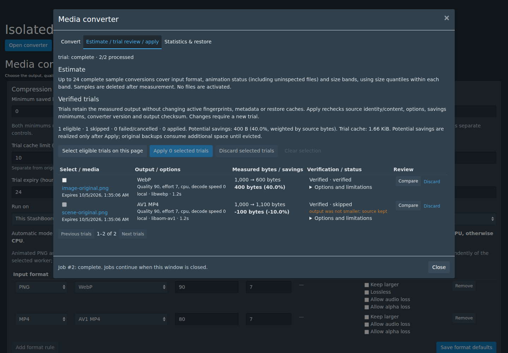
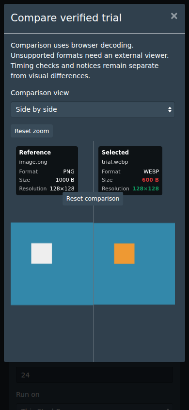

# P09 — conversion review and savings policy

Implemented from merged P08 baseline `2e00454f3b063b729ce98e61afb69916cc44a5d8`
on `feat/p09-conversion-review-20261004` in [PR #133](https://github.com/Dusky-dev/StashBooru/pull/133).
The final compatibility merge includes develop at
`6240a022b74e121174756f8b0a33f6df05e455f9` (P08 editor follow-up #132), with UI
validation, bundling and the P09 browser flow rechecked. No database migration or
dependency upgrade is introduced.

## Estimate, verified trial, apply

The native converter now separates three actions:

| Action | Processing | Active files / restore entries |
| --- | --- | --- |
| Estimate | Encode and verify up to 24 complete samples, stratified by input format, animation status and size. Pick median/minimum/maximum size samples within each stratum. Uninspected animation status has its own stratum. | Unchanged; sample output and manifest are deleted after measurement. |
| Verified trial | Use the selected encoder/options, verify output, measure exact bytes and retain a reviewable output. | Unchanged; trials use a separate temporary cache. |
| Apply | Revalidate a selected saved output and activate those exact bytes through the existing conversion journal. | Native file ID is preserved. Existing original backup, restore/unrestore and recovery behavior is reused. |

Size strata are ≤1 MiB, 1–16 MiB and >16 MiB. The estimate weights observed
eligible savings by source bytes within each stratum. Ineligible samples project
zero savings. Failed or uncovered strata prevent a whole-selection projection.
The displayed minimum/maximum sample envelope is explicitly an observed range,
not a confidence interval or a guarantee.

Trial review is paged at 50 entries. It shows typed Image/Video links, output
format, effective options, exact before/after/saved bytes and percent, encoder,
worker, elapsed encoding time, verification/status, skipped reasons, expiry and
limitations. Eligible, skipped, failed/cancelled and applied counts are distinct.
Potential savings are labelled separately from applied savings and original
backup usage.

Still-image comparison reuses P03 side-by-side, wipe, blink and difference
controls. The converter is hidden while the comparison dialog owns focus, and
returns with the review selection preserved. Complete source/output links are
available for animation, Video and browser-unsupported formats. Browser decoding
and a still preview do not establish synchronized playback or whole-animation
equality.

## Savings policy

For positive source bytes B and verified output bytes A, compression is eligible
only when B−A > 0, B−A ≥ minimum saved bytes, and 100×(B−A)/B ≥ minimum saved
percent. Both enabled minima must pass; equality at a boundary passes.

| Setting | Default | Scope |
| --- | --- | --- |
| Minimum saved bytes | 0 | Global setting plus per-job override |
| Minimum saved percent | 0 | Global setting plus per-job override |
| Trial cache limit | 10 GiB | Separate from the existing original backup cache; zero disables saved trials |
| Trial expiry | 24 hours | Configurable from 1 to 168 hours |

Zero disables the individual minimum; compression still requires a smaller,
positive verified output. Keep-larger cannot bypass this policy. The legacy
direct compression action enforces the same gate. Intentional upscaling retains
its separate activation/restore path and explicit larger-output policy.

The gate runs after output verification and before an original backup or active
file is created. Skipped compression leaves the source bytes, fingerprints,
relationships and user metadata unchanged. A skipped trial can retain measured
output for comparison, but cannot be applied.

## Saved output binding and lifecycle

Each saved trial binds the native source ID/path/size/fingerprints, measured
source modification time, source SHA-256, effective options, savings policy,
selected worker endpoint/version signature and output SHA-256/MD5. Apply checks
the current target still owns the same primary file, then rechecks every binding.
Changed source, options, policy, worker version or output requires a new trial.
Apply does not invoke the encoder again.

The worker signature covers converter/upscaler code, FFmpeg/FFprobe,
cjxl/djxl, Pillow and linked image codec versions, plus the NVIDIA driver when
available. The verified result returns the signature too, detecting a worker
change during encoding. Remote saved trials require the updated
`scripts/media_conversion_worker.py` to be installed and the worker restarted;
an older worker produces an actionable error. No new encoder wire options or
model downloads are required.

Trials live below `media-conversions/trials/<ID>`, separate from original
restore backups. Cancellation removes partial output and keeps an item status.
Transient estimates remove their entire trial directory. Startup and subsequent
conversion/scan/clean jobs reconcile interrupted encodes/applies and clean expired
trials. Reducing the trial limit evicts oldest retained output on the next cleanup;
an output that would exceed the configured limit fails without activation.

Batch preflight accounts for proposed output, staging and original backups.
Unknown output/staging size reserves twice the source bytes each; apply also
accounts for originals. Saved apply checks measured output copy space and backup
space again. The UI labels these as conservative planning estimates: codec
working files, filesystem changes and actual output sizes can vary.

Decoding verification checks dimensions, frame count, duration and exposed
animation delay/loop/audio constraints. It does not prove pixel equality or
preservation of every embedded profile/container field. Trial notices identify
animation and permitted alpha/audio loss. Native metadata and provenance remain
owned by StashBooru.

## API

The existing authenticated `image/converter` endpoint adds:

- POST actions `estimate` / `trial`: typed targets, existing encoding/default
  flags, optional backend and `savings: {minimumSavedBytes, minimumSavedPercent}`.
- POST `apply-trials`: `trialIDs` plus the current encoding/default/backend and
  savings selection. IDs and typed primary-file ownership are revalidated.
- POST `discard-trials`: `trialIDs`; active encoding/apply entries cannot be
  discarded.
- GET adds `trials`, `trialStats`, `trialTotal` and `trialOffset` pagination;
  jobs expose their action, estimate, reservation and item status/trial ID.
- GET `?trialID=<ID>&file=source|output` serves only canonical retained,
  unexpired manifest-owned regular files with private/no-store caching.
- POST `save-defaults` accepts the savings policy, trial cache bytes and expiry.

Review jobs use the existing bounded, cancellable job manager and mutation lock.
Selections are limited to 10,000 targets/trial IDs; estimates encode at most 24.

## Verification — 2026-10-04

- Focused savings/trial tests and the native SQLite P09 integration test passed:
  larger/equal output, each inclusive minimum boundary, both minima, zero sizes,
  unchanged source/metadata, actual measured timestamps, changed binding rejection,
  partial-output cancellation, estimate cleanup, cache/TTL eviction, interrupted
  encode/apply recovery, apply without re-encoding, restore and intended-status
  weighted totals.
- The native SQLite test preserves Image/file IDs, direct Tags/Characters/Artists,
  Copyrights, gallery order, visual stack, user metadata, URLs/custom provenance
  and exact restored bytes/fingerprints through trial/apply/restore.
- Full `make test`, `make it` and `make lint` passed; Go lint reports zero issues.
- UI validation passed all 30 tests, JS/CSS lint, TypeScript and formatting.
  Test TypeScript independently passed. Node 24 uses
  `TS_NODE_TRANSPILE_ONLY=true make validate-ui`; pnpm is the locked 10.33.0.
- `make generate-backend`, `make generate-ui` and `make ui-only` passed.
  Built-ins/dependency locks remain unchanged.
- Python worker suite: 32 tests, 27 passed and 5 availability skips. Available
  CPU codec fixtures run actual encoding/decoding; signature changes are tested.
- Windows and macOS converter test executables cross-compiled successfully.
  This is compile coverage, not runtime verification on those operating systems.
- Chromium 143 passed the mounted native component flow at 1440×1000 and
  390×844: estimate uncertainty, explicit trial creation, exact measured rows,
  typed links, skipped selection rejection, comparisons, parent dialog isolation,
  apply selection, discard, global minimum/cache/TTL payloads and reopening.
- `git diff --check` passed.

Run the isolated component suite from `ui/v2.5`:

```sh
PLAYWRIGHT_MODULE=/path/to/playwright/index.mjs \
CHROMIUM_EXECUTABLE=/path/to/chromium \
STASH_BROWSER_SCREENSHOTS=/tmp/p09-review \
  node tests/browser/conversion-review.mjs
```

It starts a local Vite fixture with native components/styles and browser-local
API/image responses. It never connects to a user's catalogue or performs real
conversion writes. Store/database tests use synthetic worker responses; those
results are separate from the Python real-codec checks. Production media, physical
GPU encoding, other browser engines and synchronized animation/Video comparison
remain unverified or outside this package. No manual owner testing is claimed.

| Desktop review | Mobile still-image comparison |
| --- | --- |
|  |  |

Next package: P10, robust Video duplicate/interval matching. P09 publication
details are recorded in the implementation progress ledger. Merge and deployment
require a separate owner decision.
