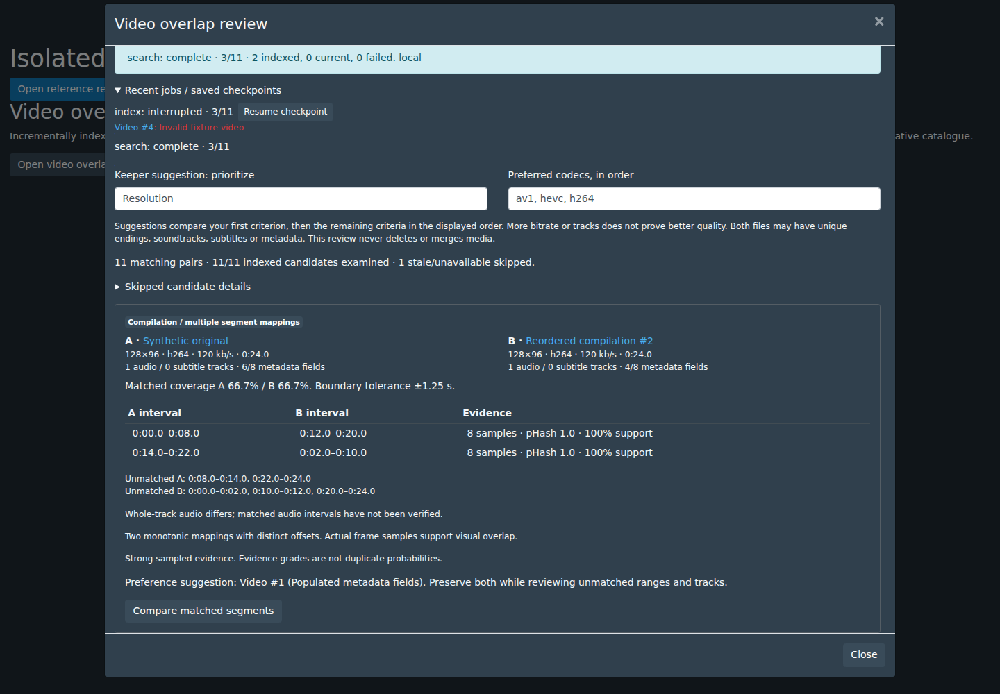
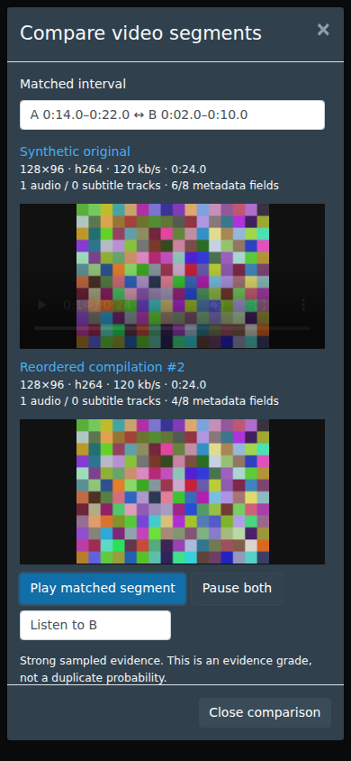

# P10 — Video overlap and containment review

Implemented from merged P09 `develop` at
`57443b7a8773de267cad81ba80c461fc8363a15e` on
`feat/p10-video-overlap-20261004` in [PR #134](https://github.com/Dusky-dev/StashBooru/pull/134).
Native media/files/relationships and existing
conversion restore journals are preserved. No catalogue migration, GraphQL
generation, model download or dependency upgrade is required.

## Native workflow

Open **Settings → Tasks → Video overlap / containment**, or **Find overlapping
segments…** in a Video's detail operations menu. The detail action supplies its
native Video ID and pauses the existing player. Index the reference and the
library, then search using that reference. Requests use the current visible
settings; **Save index settings** also persists them as future defaults.

| Setting | Default | Bounds / behavior |
| --- | --- | --- |
| Backend | Auto | Configured remote first, then local CPU; explicit Remote only never falls back. Uses the existing System remote URL/token. |
| Sampling interval | 1 second | 0.5–10 seconds; widened for long files to at most 3,600 frames. |
| Audio digest | Off | Optional decoded SHA-256 of the first whole audio track at 8 kHz mono. |
| Maximum pHash distance | 8 | 0–8, with independent dHash ≤12 and mean RGB distance ≤30 checks. |
| Minimum interval | 4 seconds | 2–120 seconds, also requiring four samples and four distinct informative pHashes. |
| Candidate limit | 200 | 1–1,000; truncation and omitted common postings are disclosed. |

Whole-file duplicates use actual SHA-256 equality, with both current files
rehashed before making that claim. Every other result is supported by a sequence
of timestamped samples. A thumbnail, whole sprite hash, embedding, equal duration
or quality score cannot establish overlap.

| Result | Meaning |
| --- | --- |
| Exact file duplicate | Whole-file SHA-256 equality. |
| Near-complete visual duplicate | At least 90% sampled coverage on both timelines, without incompatible segment offsets. Audio can differ. |
| Contained clip | At least 90% coverage on one timeline; the other may contain additional material. |
| Partial overlap | Supported mapped ranges leave substantial material outside those ranges. |
| Compilation / multiple segment mappings | Distinct offsets or reordered mappings; each individual mapping remains monotonic. |

Each pair saves ranges on both timelines, offsets, matched coverage, internal
gaps, unmatched ranges, sample/distinct-frame counts, mean hash distances, sample
support, boundary tolerance, an evidence grade and audio limitations. Coverage
excludes unsupported internal gaps. Strong sampled evidence requires every
mapping to have at least eight distinct frames, ≥85% support, mean pHash ≤4,
mean dHash ≤8, and no alignment limit. Other accepted sequences receive a limited
sampled evidence grade. These grades and support percentages are **not calibrated
duplicate probabilities** and apply only to the supported ranges.

Review shows ten pairs per page. Native `/scenes/<ID>` links retain typed Video
identity. Primary-file/index changes mark saved pairs stale and disable comparison.
The comparison owns focus while preserving the underlying review/page/settings.
It loads two native MP4 streams without autoplay, offers explicit synchronized
play/pause, maps offsets, follows the first player's seeks/rate, stops at the
selected segment end and clears both streams on dismissal. Mobile views stack
the players and allow the evidence/unmatched sections to scroll. Audio can be
muted or auditioned from either file; full native pages expose the other tracks.

Keeper preferences persist in browser storage. They compare the chosen first
criterion, then the remaining displayed criteria: resolution, an explicit codec
ordering, bitrate, duration, audio tracks, subtitle tracks and populated metadata
fields. Ties have no suggested keeper. More bitrate/tracks need not mean higher
quality, and unmatched endings, alternate audio/subtitles or metadata may matter.
The review has **no delete, merge or conversion action**. Containment, partial and
compilation rows explicitly prompt preservation of both files during review.

## Sampling, index and alignment

The standard-library Python sampler needs Python 3, FFmpeg and FFprobe. Deploy it
with the server or set `STASH_VIDEO_OVERLAP_WORKER` to its installed path;
`STASH_PYTHON` can select the Python executable. It selects
existing decoded frames by presentation timestamp, retains VFR timing, applies
the display rotation, preserves aspect ratio and returns 32×32 RGB previews.
Go crops conservative symmetric dark padding and computes 64-bit pHash/dHash plus
mean RGB. Uniform near-black/near-white or low-information frames are rejected.
Repeated fingerprints are downweighted; four or more identical samples cannot
establish a title/static sequence. Canonical hashes accommodate tested resolution
and black-bar changes; arbitrary crops or overlays are outside this version.

The decoder signature covers sampler code and complete FFmpeg/FFprobe version
reports. The algorithm version is `pts-phash-dhash-rgb-bars-v1`. Saved signatures
bind the native Video/primary-file IDs, path, measured size/mtime, active native
MD5/OSHASH fingerprints, whole-file SHA-256, decoder, settings, actual sample
times/grid and media properties. `source_md5` lineage is not active-file identity.
Source bytes and native ownership are checked again before atomic index writes.

StashBooru owns a rebuildable SQLite sidecar at
`<config directory>/video-overlap/index.sqlite` (format version 1). It contains
fingerprints, settings and job/review checkpoints, with no media payload or remote
credentials. It does not change the native schema or consume conversion backups.
The stored-signature count can include stale/deleted Videos; it is not a promise
of current library coverage. Native backup/import operations do not carry this
derived sidecar. Rebuild it with a library index after moving/restoring a catalogue;
retain a consistent SQLite backup of the sidecar separately if checkpoints matter.

Candidate retrieval probes an inverted index of nine disjoint pHash bands, then
aligns only the bounded shortlist. No whole-library pairwise frame comparison or
duration gate is used; an eight-second clip can retrieve a much longer collection.
An independent indexed SHA-256 lookup prioritizes exact copies, including blank
videos. Bands exceeding 10,000 postings are omitted with an explicit incomplete
result warning. Alignment checks at most two million candidate frame edges per
pair, retains at most 64 edges per reference sample and 64 mappings per pair.
Limit warnings survive even if the affected pair produces no accepted interval.

Alignment groups offset hypotheses and extracts monotonic unit-speed runs with
forward timing, gap/support and distinct-frame checks. Offset tolerance is 1.25×
the larger grid step (±1.25 seconds on the default grid), not frame precision.
A fitted clock-rate difference over 10% is rejected so systematic speed drift
does not create fake compilation cuts. True speed normalization, dynamic time
warping, arbitrary geometric correction, repeated reuse of the same range across
multiple compilation occurrences and audio interval alignment are not implemented.

The optional audio digest is supporting evidence only: different whole-track
digests may reflect trimming, lossy reencoding, dubbing or missing audio. Equal
digests do not verify every track or align audio segments. Muted/dubbed clips remain
eligible for visual matching; default matching has no audio requirement.

## Jobs and worker deployment

Indexing/search run through the native cancellable Jobs queue. Library index jobs
capture a native ID upper bound and walk pages of 500 IDs; new higher IDs wait for
a subsequent job. Each completed file/signature and job cursor is persisted.
Unchanged entries are skipped; failures are retained as per-item errors while the
job continues. Only the last 50 item messages are displayed, while failed IDs and
the cursor remain durable for resume. Failed retries retain their checkpoint/error
on cancellation. Other-server-session jobs appear interrupted after restart and
can resume without interpreting recycled native job IDs as the original job.

Resume continues the captured job/settings and retries failures. Start another
library index after decoder/settings changes to refresh earlier completed entries.
Force reindex handles an externally changed file whose native hashes/stat identity
have not changed; rescan native size changes first. Approximate cached signatures
cannot detect deliberate byte changes preserving all those identity attributes.
Exact-file search additionally rehashes source bytes before asserting equality.

Processing is limited to known-duration regular video files of at most 24 hours.
Decoder processes have bounded output and deadlines; cancellation kills local
process groups and remote disconnects stop decoder children/clean uploads. File
and pipe protocols plus a video-format allowlist reject network playlists.

Remote hosts need both `scripts/video_overlap_worker.py` and the updated
`scripts/visual_embedding_server.py`, followed by a server restart. No new model
is needed. The authenticated endpoints are GET `/v1/video-overlap/capabilities`
and POST `/v1/video-overlap/sample` with a bounded octet upload and
`X-Stash-Video-Options`. They share the existing processing lock/upload cap; busy
workers return an item error. Capability/version mismatch is actionable. The
default upload limit is inherited (512 MiB), so larger remote files require that
existing worker setting to be raised, or an explicitly selected local backend.

StashBooru's existing authenticated `scene/overlap` endpoint accepts POST actions
`configure`, `index` (explicit IDs or all), `search`, `resume` and `cancel`; GET
returns settings, stored/native counts, eight recent jobs, a selected job and
paged review rows. It bounds requests at 256 KiB, explicit targets at 10,000 and
rejects unknown fields/multiple JSON requests. Review GETs use no-store caching.

## Verification — 2026-10-04

The repeatable labelled fixtures contain deterministic synthetic footage encoded
by actual FFmpeg H.264/AAC codecs. They are not production-library or physical GPU
measurements. All 14 cases passed actual Python sampling, Go fingerprinting,
matching and indexed short-clip retrieval:

| Fixture | Measured result | Coverage A / B | Expected offset |
| --- | --- | --- | --- |
| Exact bytes | Exact file | 100% / 100% | 0 s |
| Reencode | Near-complete visual | 97.9% / 97.9% | 0 s |
| Lower resolution | Near-complete visual | 97.9% / 97.9% | 0 s |
| Pillarboxing | Near-complete visual | 97.9% / 97.9% | 0 s |
| Trim start/end | Contained clip | 58.3% / 96.4% | −5 s |
| Inserted intro | Contained clip | 97.9% / 75.0% | +8 s |
| 8 s clip in 36 s collection | Contained clip | 93.8% / 22.2% | +15 s |
| Reordered halves | Compilation, two mappings | 97.9% / 97.9% | Different offsets |
| Shared sequence with unmatched suffix | Partial overlap | 50.0% / 47.9% | −12 s |
| Different soundtrack | Near-complete visual; audio differs | 97.9% / 97.9% | 0 s |
| Unrelated files sharing a static title | No accepted match | — | — |
| Black frames | No accepted visual match | — | — |
| Variable frame rate | Near-complete visual | 93.8% / 97.9% | Existing noninteger PTS |
| 1.5× speed | No accepted match | — | Unsupported rate change |

Expected offsets passed within the reported ±1.25 s default tolerance. Exact-file
equality has zero sampling tolerance. Independent Python tests exercise actual
display-matrix rotation, VFR/noninvented timestamps, optional audio, authenticated
remote upload, busy responses, cancellation and temporary-file cleanup. The
native SQLite and API tests separately verify checkpoint/restart/resume/retry/cancellation,
incremental skip, captured ID bounds, malformed requests, active-file/decoder/
settings invalidation, byte revalidation and unchanged IDs/metadata/relationships/
fingerprints/provenance. Synthetic hash tests cover gaps and temporal classes.

Chromium 143 mounted native components/styles at 1440×1000 and 390×844, using a
mocked review API and actual synthetic MP4 streams. Jobs/settings, unsaved remote
selection, resume/cancel, paging, typed links, keeper persistence, repeated opens,
no autoplay, synchronized offsets, pause/segment selection/audio controls, stream
cleanup, stale/empty/error/limit states and viewport bounds passed. No manual owner
test, full signed-in production catalogue, hardware GPU, alternative browser codec
stack or real-world recall/false-positive calibration is claimed.

Reproduce with `make test-video-overlap`, the normal backend/UI repository gates,
and `node tests/browser/video-overlap.mjs` from `ui/v2.5`. The browser suite requires
`STASH_VIDEO_OVERLAP_FIXTURES` pointing to a generated fixture directory and the
Playwright/Chromium environment described in [P07 notes](p07-global-media.md).
Generate the directory with
`python3 scripts/tests/video_overlap_fixtures.py --output <directory>`.

