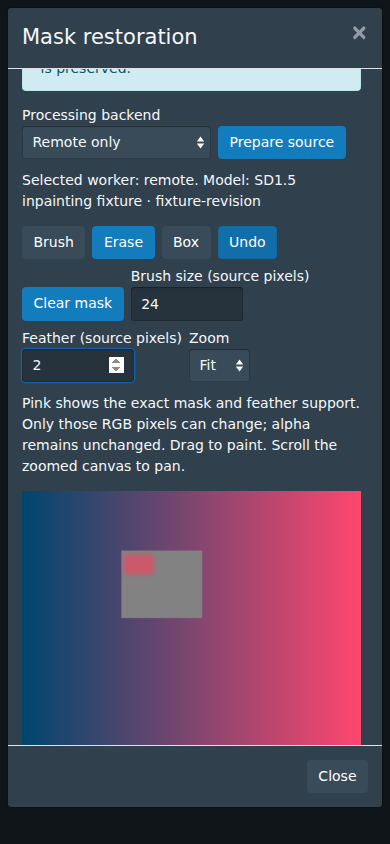
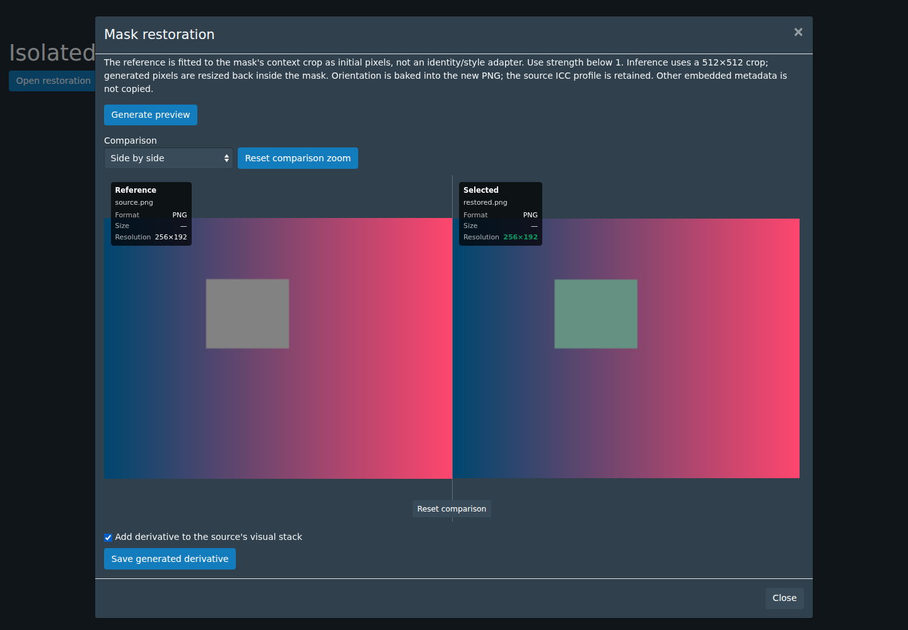
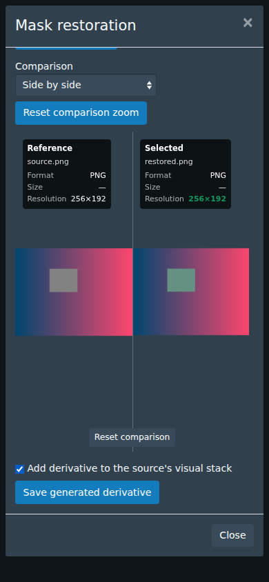

# P11 — masked still-image restoration

Implemented 2026-10-04 on `feat/p11-image-restoration-20261004`, based on merged
P10 `develop` at `c63027cf995304614a2e42c31c41d7fecbcdbc99`.

## Workflow

Image details → Operations → **Mask restoration…** opens a native themed modal,
independent of conversion and upscaling. Prepare the source, paint a mask, generate
and compare a preview, then save the reviewed result as a new Image. The UI labels
it as generated restoration: plausible generated pixels do not recover hidden
information. This package covers non-explicit still imagery only.

The editor supplies brush, erase, box, clear, bounded undo, finite feathering and
Fit/2×/4× zoom with scroll panning. The pink overlay shows the exact effective
mask, including feather support, in source coordinates. Editing the mask, reference
or settings invalidates Save until another preview is generated. P03's existing
comparison supplies side-by-side, wipe, blink and difference modes with shared
pan/zoom. Closing cancels outstanding jobs and discards unsaved sessions.

A reference supplies **starting pixels** fitted to the mask's context crop; it is
not an identity/style adapter. Reference use requires strength below 1. Uploading
one initially selects strength 0.75. Prompt, negative prompt, seed, steps, guidance,
strength and auto/GPU/CPU are recorded. The model safety checker is mandatory;
flagged or unknown generated results are rejected.

## Model and installation

The adapter uses the dedicated nine-channel `StableDiffusionInpaintPipeline` for
[stable-diffusion-v1-5/stable-diffusion-inpainting](https://huggingface.co/stable-diffusion-v1-5/stable-diffusion-inpainting).
This repository is a mirror of the deprecated Runway release, not affiliated with
Runway. Its model card describes a 512×512 inpainting model under
[CreativeML OpenRAIL-M](https://compvis-stable-diffusion-license.static.hf.space/index.html),
which includes use restrictions. Review that license and model card before installing
or redistributing weights; the application source license does not replace them.
The [official Diffusers inpainting API](https://huggingface.co/docs/diffusers/api/pipelines/stable_diffusion/inpaint)
documents the actual mask, strength and callback controls used here.

Weights and heavy Python dependencies are not bundled or downloaded by StashBooru.
Use a dedicated worker Python environment with Pillow, a compatible PyTorch CUDA
build, Diffusers, Transformers, Accelerate, Safetensors and Hugging Face Hub. Keep
the embedding worker's existing dependency requirements in that environment.
The following is an **explicit owner-run download**, not an application startup step:

```sh
hf download stable-diffusion-v1-5/stable-diffusion-inpainting \
  --revision 6566db6a08ee21a75d9fb16ec0855102a3bdb9b2 \
  --include '*.json' '*.txt' '*.fp16.safetensors' 'README.md' \
  --local-dir /path/to/sd15-inpainting
export STASH_RESTORATION_MODEL_DIR=/path/to/sd15-inpainting
export STASH_RESTORATION_REVISION=6566db6a08ee21a75d9fb16ec0855102a3bdb9b2
python3 scripts/image_restoration_worker.py capabilities
```

The snapshot needs model/config/tokenizer/scheduler/feature-extractor files and
**fp16 safetensors for UNet, VAE, text encoder and safety checker**. The loader uses
`local_files_only=True`, `use_safetensors=True` and `variant="fp16"`; it neither
falls back to pickle weights nor fetches missing files. Set the environment on the
process that executes the adapter, then restart it. For local execution,
`STASH_PYTHON` selects the dedicated interpreter and `STASH_IMAGE_RESTORATION_WORKER`
can select the adapter path. Remote hosts need the updated server and adapter files,
plus P10's sampler required by the merged server.

CUDA uses fp16 with attention/VAE slicing. CPU is disabled unless the worker sets
`STASH_RESTORATION_ALLOW_CPU=1`; it then uses float32 and remains subject to the
15-minute deadline. Explicit GPU-only never retries on CPU, and explicit CPU uses
CPU even if CUDA exists. Auto prefers CUDA and has no automatic OOM retry.

Capabilities advertise protocol, model ID, configured revision, installation
signature, hardware, limits and reference mode. The signature includes adapter
SHA-256, dependency versions and installed file size/mtime records. The revision
is the owner's pinned installation claim, not a cryptographic weight audit.
A missing/incomplete model or unavailable hardware produces setup instructions;
source preparation can still decode a supported image without loading a model.

## Pixels and bounds

| Item | Bound/behavior |
| --- | --- |
| Native source | Regular, extracted, still PNG/JPEG/WebP; at most 32 MiB |
| Canvas | At most 16 Mi pixels and 8192 pixels per side |
| Precision | 8-bit inputs; high bit depth, CMYK, animation and other formats rejected |
| Raw mask | Opaque grayscale PNG; matching canvas; non-empty; at most 24 MiB |
| Feather | Radius 0–16 source pixels; integer separable box blur with zero padding |
| Reference | At most 8 MiB; same supported decode limits |
| Model work | Mask bounds plus 32 pixels of context, fitted/padded into 512×512 |
| Controls | Steps 5–50; guidance 1–15; strength .05–1 with at least one denoise step; seed 0–2147483647 |
| Transport | 96 MiB upload/result/expanded archive; fixed entry names; no extraction/traversal |
| Jobs | 15-minute client/inference limit; process-group cancellation locally; callback disconnect checks remotely |
| Previews | 24-hour expiry; at most 16 active sessions; conservative headroom within 1 GiB |

Preparation bakes EXIF orientation into an 8-bit RGBA PNG, retains the ICC profile,
and omits other embedded metadata from the derivative. The original bytes remain
intact. Pixel preservation compares the canonical, oriented source canvas rather
than compressed JPEG bytes or the pre-orientation raster. Only the generated crop
is resized back to its source region; the whole source is never globally resized.
The final composite uses the effective mask, preserves all alpha, and preserves
RGBA exactly wherever the mask is zero. Go independently validates these properties
before allowing preview/save. Soft-mask edge tests verify the actual Pillow blend;
subjective seam quality with real diffusion remains a hardware acceptance check.

## Jobs, transport and persistence

Native `GET/POST /image/restoration` handles capabilities, prepare, generate, save,
cancel and discard through the existing authenticated server. Prepare/generate
use cancellable native Jobs; requests strictly validate size, options and session
identity. Worker model paths and credentials are never provided by image requests.

The existing worker exposes separate authenticated
`GET /v1/restoration/capabilities` and `POST /v1/restoration` endpoints. It reuses
Bearer authentication, inference/conversion serialization and bounded temporary
uploads. Busy workers return 503. Results include a whole-bundle SHA-256 header
and a receipt with the output SHA-256, canvas, actual hardware, model/revision,
context crop, work size and duration. Explicit remote-only never runs a local
fallback. Auto can select local only during capability negotiation, with a notice;
processing failures are surfaced rather than silently rerouted.

Sessions are atomically journaled under the configuration directory's
`image-restoration/<id>`. Unfinished work is cleaned and requires a new session
after interruption. A `saving` journal reconciles its unique destination with
native catalogue registration on the next read/preparation. Saved records keep
raw/effective masks, optional reference and provenance; bulky source/preview/
transport copies are removed. Expired unsaved sessions are pruned during new
preparation. Permanent saved provenance is excluded from the preview quota.
There is no new native migration or backup contract; preserve this directory with
application configuration if retained masks are needed after restoring a backup.

Save revalidates the current source primary-file ID, path, native size and actual
SHA-256; it also checks all preview/mask/reference hashes and the unmasked pixel
contract. It copies the **exact reviewed PNG bytes**, without rerunning inference,
to a new adjacent `<stem>.restored-<session>.png` using exclusive creation. A native
transaction creates a distinct Image/file, copies direct metadata and relationships
(including all Artists, Characters, Copyrights, Tags, URLs, custom fields and
Gallery membership), and optionally appends to the source's visual stack. Existing
stack identity, order, labels and representative are retained. Failure rolls back
catalogue writes and removes the new destination. Source IDs, bytes and active
files are never replaced. Fresh fingerprints describe the derivative; source
fingerprints retain lineage. Thumbnail generation uses the existing native path.

The title gains `[Generated restoration]`. The `StashBooru restoration` custom
field records source Image/hash, raw/effective mask/reference hashes, model/revision,
seed/options and journal ID. The original file and native metadata remain available.
A saved derivative uses ordinary native Image viewing and selection.

## Verification — 2026-10-04

- Backend generation, full `make test`, `make it` and `make lint` passed.
- Native SQLite tests cover exact preview/save bytes, unchanged originals, distinct
  primary files, metadata/relationships/fingerprints, new stacks, appending to an
  existing mixed Image/Video stack, source/preview changes and transactional rollback.
- Go tests cover finite feather support, exact unmasked pixels/all alpha, corrupt
  authenticated transport, remote-only selection, bounded archives, preview pruning
  and local cancellation removing partial results.
- Python restoration suite: nine tests passed using real Pillow and authenticated
  HTTP; diffusion/PyTorch are declared stubs. The combined merged worker suite had
  46 passes and five JPEG XL availability skips before the added soft-edge test;
  the nine-test restoration rerun includes that new case.
- UI validation: 35 tests, JS/CSS lint, TypeScript and formatting passed; production
  bundling passed. Test TypeScript also passed. No locked dependency upgrade.
- Chromium 143 at 1440×1000 and 390×844 passed mounted native mask tools,
  undo/feather/zoom, remote/GPU choices, optional reference/FileReader, comparison,
  dirty-preview invalidation, exact reviewed mock save, typed native link, missing
  model, repeated opens, cancellation and late-response cleanup. HTTP processing is mocked; screenshots
  inspected. Native catalogue tests independently exercise persistence.
- Windows processing package cross-compiled; `git diff --check` passed.

No model download, actual diffusion inference, physical RTX 3060/12 GiB VRAM
measurement, Windows runtime test or manual owner test is claimed. On the target
worker, run one 512×512/20-step non-explicit fixture, record time/peak VRAM, inspect
seams and compare the saved PNG to the preview before using it for library work.
Animation/Video restoration and automatic mask detection are outside this package.






