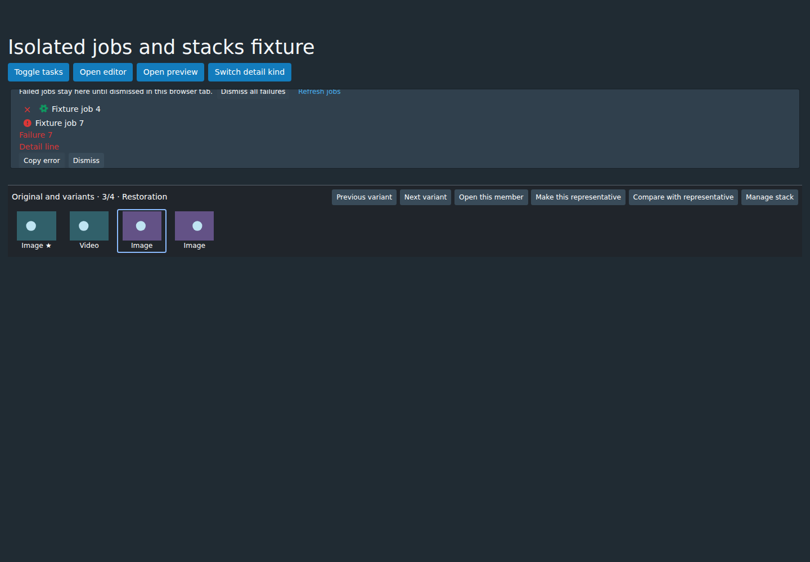
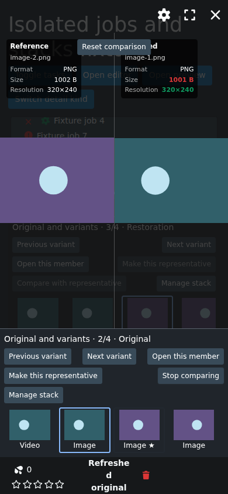
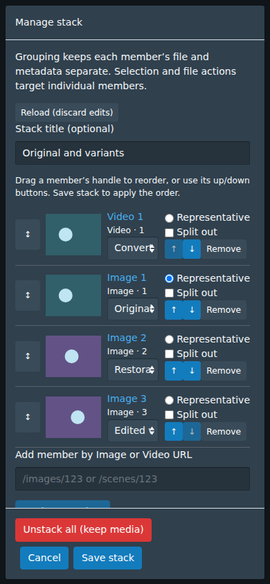

# Jobs and stack review shortcuts

This owner-requested batch implements three final QoL items before maintenance.
It starts from merged P12/P13 `develop` at
`a061a22cbbd3c8fee30dd14e1b5c13e45326d984` (PR #138). Branch:
`feat/qol-jobs-stacks-20261004`.

## Failed jobs

Settings → Tasks retains failed jobs until **Dismiss** or **Dismiss all failures**.
The application watches jobs while other pages are open. Failures survive page
navigation and refresh in the same browser tab, scoped to the server URL.
Closing the tab ends this history. Jobs that finish while the application is
closed or disconnected are not reconstructed as durable server history.

**Copy error** copies the complete error, preserving line breaks. A clipboard
fallback supports insecure HTTP and reports a failed copy. Errors without
details still allow dismissal. Successful and cancelled jobs retain the existing
ten-second departure; stopping/progress/ETA remain native.

Job identity includes its creation time because numeric IDs restart with the
server. Subscription events received during a queue query take precedence over
its snapshot. Expiry and dismissal prevent stale queries from resurrecting old
jobs. Timers and the application subscription are disposed on unmount. A warning
explains when browser storage cannot preserve failures across refresh.

## Filmstrip shortcuts

**Make this representative** updates the selected Image or Video using the
existing version-checked stack mutation. It preserves member order, labels and
typed identity. The current viewer selection stays put, and catalogue badges and
stack reads refresh. Stale versions show an error and **Reload stack**; no forced
overwrite occurs.

**Compare with representative** opens the existing shared comparison for two
different Image members. It is available from Image details and an open stack
preview. It starts in Both images; the native Reference view controls also offer
Slider, Blink and Difference heatmap. Video pairs remain disabled under P03's
still-image comparison scope. **Stop comparing** returns to the selected member.

Comparison remains owned by the active caller. Switching callers starts a fresh
viewer, and dismissal releases its stack cache observer synchronously. Late
mutations can refresh catalogue data without reopening or updating a dismissed
viewer. Native Video navigation remains explicit.

## Reordering

Manage stack has a dedicated drag handle for mouse, pen and touch. A highlighted
edge previews the drop; the editor scrolls near its edges. Dropping reorders only
the draft. **Save stack** applies it through the existing version check. Escape,
pointer cancellation and drops outside the editor leave the order alone.

The existing accessible **Move up/down** buttons remain available. Position
changes are announced through a live region. Radio/checkbox selections, labels
and representative identity follow their member rather than its numeric position.

## Verification

The repository remains on pnpm 10.33.0 with unchanged locked dependencies. Checks:

```sh
cd ui/v2.5 && pnpm run gqlgen
cd ../..
make validate-ui
make ui-only
node ui/v2.5/tests/browser/jobs-stacks.mjs
git diff --check
```

`make validate-ui` passed all **42** tests, JavaScript/CSS lint, TypeScript and
formatting on Node 20, matching CI. GraphQL UI generation and production bundling
passed. The job subscription now also requests the existing `addTime` field;
there is no backend schema or migration change.

The mounted Chromium 143 suite passed desktop 1440×1000 and mobile 390×844,
including native touch input, drag cancellation, keyboard ordering, draft/save,
equal Image/Video IDs, labels/representative retention, stale version rejection,
late job queries, ten-second expiry, clipboard rejection/fallback, navigation and
refresh retention, caller changes and dismissal during a pending mutation. It
checks one shared viewer, no state updates after unmount and no horizontal page
overflow. Apollo processing and media are isolated fixtures; this does not claim
human manual testing, physical-device checks or real-media decoding.

`PLAYWRIGHT_MODULE` and `CHROMIUM_EXECUTABLE` may select installed dependencies.
`STASH_BROWSER_SCREENSHOTS` optionally saves captures. No catalogue is needed and
the suite makes no application-server writes. Examples are synthetic fixtures:

| Failed-job actions | Stack comparison |
| --- | --- |
|  |  |



Named processing presets and conversion CSV/JSON export remain deferred. Next is
maintenance and cleanup after this batch merges; P11's actual model/GPU acceptance
and P12/P13's production activation gates remain separate milestones.
